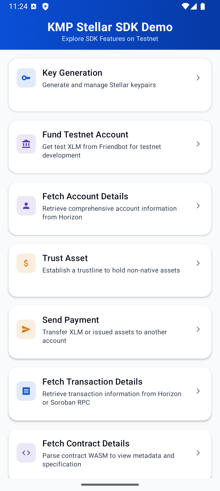
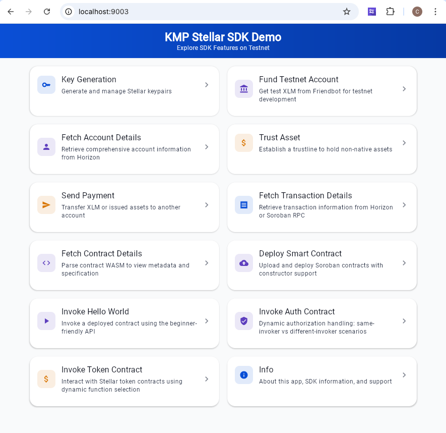
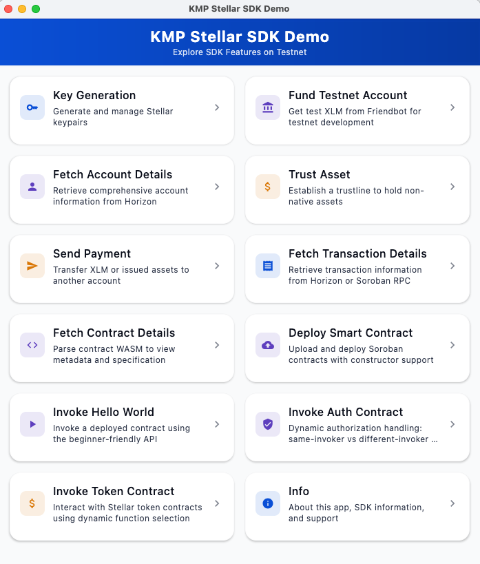
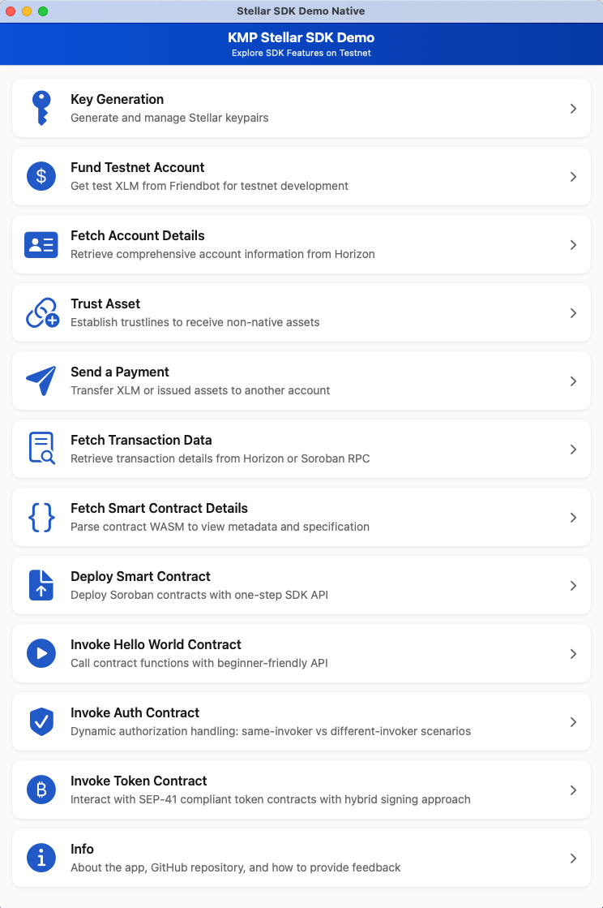

# Stellar SDK Demo App

A comprehensive Kotlin Multiplatform demo application showcasing the Stellar SDK's capabilities across all supported platforms (Android, iOS, macOS, Desktop, and Web).

## Overview

This demo app demonstrates real-world usage of the Stellar SDK, including key generation, account management, payments, trustlines, and smart contract interactions. The demo's primary purpose is to showcase SDK functionality for developers learning how to use the SDK. The app follows a modern KMP architecture with shared business logic and platform-specific UIs.

**Note for External Developers**: This demo uses project dependencies (`api(project(":stellar-sdk"))`) to showcase advanced native Swift interop in the macOS app. Most developers should use Maven artifacts (`implementation("com.soneso.stellar:stellar-sdk:0.4.0")`) which work perfectly for Compose Multiplatform and standard KMP apps. See [docs/platforms/](../docs/platforms/) for platform-specific setup instructions.

## Screenshots

The demo app runs on all major platforms with a consistent celestial-themed UI:

### Mobile

<table>
  <tr>
    <td align="center">
      <br>
      <b>Android</b>
    </td>
    <td width="100"></td>
    <td align="center">
      <br>
      <b>iOS</b>
    </td>
  </tr>
</table>

### Web

<table>
  <tr>
    <td align="center">
      <br>
      <b>Web (JavaScript)</b>
    </td>
  </tr>
</table>

### Desktop

<table>
  <tr>
    <td align="center">
      <br>
      <b>Desktop (JVM)</b>
    </td>
  </tr>
  <tr>
    <td height="30"></td>
  </tr>
  <tr>
    <td align="center">
      <br>
      <b>macOS (Native SwiftUI)</b>
    </td>
  </tr>
</table>

## Architecture

The demo app uses a **Compose Multiplatform** architecture with maximum code sharing:

```
┌─────────────────────────────────────────────────────────────┐
│         Shared Module (demo/shared)                         │
│                                                             │
│  ┌───────────────────────────────────────────────────────┐  │
│  │  Common UI (Compose Multiplatform)                    │  │
│  │  • All screens and navigation                         │  │
│  │  • Material 3 design system                           │  │
│  │  • Stellar SDK integration                            │  │
│  └───────────────────────────────────────────────────────┘  │
│                                                             │
│  Platform-specific: Entry points and platform APIs only     │
└─────────────────────────────────────────────────────────────┘
                            │
        ┌───────────────────┼───────────────────┬──────────────┬──────────┐
        ▼                   ▼                   ▼              ▼          ▼
   ┌─────────┐        ┌──────────┐       ┌──────────┐   ┌──────────┐  ┌─────┐
   │ Android │        │ Desktop  │       │   iOS    │   │  macOS   │  │ Web │
   │ Compose │        │ Compose  │       │ Compose  │   │ SwiftUI  │  │  JS │
   └─────────┘        └──────────┘       └──────────┘   └──────────┘  └─────┘
```

**Key Points**:
- **Shared Module**: Contains 100% of the UI code (Compose) and business logic (Stellar SDK integration)
- **Platform Apps**: Minimal entry point code (5-20 lines) to launch the shared UI
- **macOS Native App**: A separate native SwiftUI app (not using the shared Compose module) - see macosApp/README.md
- **Code Reuse**: ~95% code sharing across Android, Desktop, iOS, and Web

## Features

The demo app includes 11 comprehensive feature demonstrations:

### 1. Key Generation
- Generate random Stellar Ed25519 keypairs
- Display account ID (G...) and secret seed (S...)
- Copy keys to clipboard
- Sign and verify test data
- Demonstrates: `KeyPair.random()`, `sign()`, `verify()`

### 2. Fund Testnet Account
- Get free test XLM from Friendbot
- Fund accounts on Stellar testnet
- Real-time funding status
- Error handling for already-funded accounts
- Demonstrates: `FriendBot.fundTestnetAccount()`

### 3. Fetch Account Details
- Retrieve comprehensive account information from Horizon
- Display balances, sequence number, and flags
- Show all account balances (native and issued assets)
- Real-time account data fetching
- Demonstrates: `Server.accounts()`, account data parsing

### 4. Trust Asset
- Establish trustlines to hold non-native assets
- Support for custom asset issuers
- Transaction building and signing
- Submit transactions to testnet
- Demonstrates: `ChangeTrustOperation`, transaction building

### 5. Send Payment
- Transfer XLM or issued assets between accounts
- Support for both native (XLM) and custom assets
- Amount validation and transaction signing
- Real-time transaction submission
- Demonstrates: `PaymentOperation`, transaction submission

### 6. Fetch Transaction Details
- Fetch and view transaction details from Horizon or Soroban RPC
- Display operations, events, and smart contract data
- Expandable operations and events with copy functionality
- Human-readable SCVal formatting for contract data
- Supports both Horizon and RPC APIs
- Demonstrates: `HorizonServer.transactions()`, `SorobanServer.getTransaction()`

### 7. Fetch Smart Contract Details
- Parse WASM contracts to view metadata
- Display contract specification (functions, types)
- View contract code hash and metadata
- Soroban smart contract integration
- Demonstrates: Contract WASM parsing, Soroban RPC

### 8. Deploy Smart Contract
- Upload and deploy WASM contracts to testnet
- One-step deployment with constructor arguments
- Two-step deployment (install WASM + deploy from WASM ID)
- Platform-specific WASM file loading
- Support for 3 demo contracts (hello_world, auth, token)
- Located in `shared/src/commonMain/resources/wasm/`
- Demonstrates: `ContractClient.deploy()`, `install()`, `deployFromWasmId()`

### 9. Invoke Hello World Contract
- Invoke deployed smart contracts with the "hello" function
- Demonstrate spec-based type conversion and automatic result parsing
- Use ContractClient to load contract specifications from the network
- Showcase funcResToNative for parsing XDR results to native types
- Real-time contract function invocation on testnet
- Demonstrates: `ContractClient.forContract()`, `invoke()`, `funcResToNative()`

### 10. Invoke Auth Contract
- Dynamic Soroban authorization handling with same-invoker and different-invoker scenarios
- Automatic authorization detection using `needsNonInvokerSigningBy()`
- Manual authorization signing with `signAuthEntries()` when needed
- Production-ready pattern for conditional authorization
- Educational UI showing which authorization scenario was detected
- Demonstrates: `ContractClient.forContract()`, `buildInvoke()`, `needsNonInvokerSigningBy()`, `signAuthEntries()`

### 11. Invoke Token Contract
- **Location**: `shared/src/commonMain/kotlin/com/soneso/demo/`
- **UI**: `ui/screens/InvokeTokenContractScreen.kt`
- **Logic**: `stellar/InvokeTokenContract.kt`
- **Demonstrates**: SEP-41 token contract interaction, `buildInvoke()` for multi-signature workflows, function selection, automatic type conversion for token operations (mint, transfer, balance)

## Project Structure

```
demo/
├── shared/                          # Shared Compose Multiplatform module
│   ├── src/
│   │   ├── commonMain/kotlin/       # Shared code (UI + business logic)
│   │   │   ├── ui/screens/          # All 11 feature screens + MainScreen
│   │   │   │   ├── MainScreen.kt
│   │   │   │   ├── KeyGenerationScreen.kt
│   │   │   │   ├── FundAccountScreen.kt
│   │   │   │   ├── AccountDetailsScreen.kt
│   │   │   │   ├── TrustAssetScreen.kt
│   │   │   │   ├── SendPaymentScreen.kt
│   │   │   │   ├── FetchTransactionScreen.kt
│   │   │   │   ├── ContractDetailsScreen.kt
│   │   │   │   ├── DeployContractScreen.kt
│   │   │   │   ├── InvokeHelloWorldContractScreen.kt
│   │   │   │   ├── InvokeAuthContractScreen.kt
│   │   │   │   └── InvokeTokenContractScreen.kt
│   │   │   ├── stellar/             # Stellar SDK integration
│   │   │   │   ├── KeyPairGeneration.kt
│   │   │   │   ├── AccountFunding.kt
│   │   │   │   ├── AccountDetails.kt
│   │   │   │   ├── TrustAsset.kt
│   │   │   │   ├── SendPayment.kt
│   │   │   │   ├── FetchTransaction.kt
│   │   │   │   ├── ContractDetails.kt
│   │   │   │   ├── DeployContract.kt
│   │   │   │   ├── InvokeHelloWorldContract.kt
│   │   │   │   └── InvokeAuthContract.kt
│   │   │   └── App.kt               # Main app entry
│   │   ├── androidMain/             # Android-specific (clipboard)
│   │   ├── desktopMain/             # Desktop-specific (clipboard)
│   │   ├── iosMain/                 # iOS-specific (UIViewController)
│   │   ├── macosMain/               # macOS-specific (clipboard)
│   │   └── jsMain/                  # JS-specific (clipboard)
│   └── build.gradle.kts
├── androidApp/                      # Android entry point
│   ├── src/main/java/.../MainActivity.kt
│   └── build.gradle.kts
├── iosApp/                          # iOS entry point (SwiftUI wrapper)
│   ├── StellarDemo/StellarDemoApp.swift
│   └── project.yml
├── macosApp/                        # macOS native entry point (SwiftUI)
│   ├── StellarDemo/                 # 30 Swift files (1 App + 13 Views + 10 Components + 6 Utilities)
│   │                                # Full SwiftUI architecture - see macosApp/README.md
│   └── project.yml
├── desktopApp/                      # Desktop JVM entry point
│   ├── src/jvmMain/kotlin/.../Main.kt
│   └── build.gradle.kts
└── webApp/                          # Web JS entry point
    ├── src/jsMain/kotlin/Main.kt
    ├── src/jsMain/resources/index.html
    └── build.gradle.kts
```

## Prerequisites

### All Platforms
- **Kotlin Multiplatform**: Version 2.0+
- **Gradle**: 8.5+
- **JDK**: 11 or higher

### Android
- **Android Studio**: Arctic Fox or newer
- **Android SDK**: API 24+ (Android 7.0)
- **Target SDK**: API 35

### iOS
- **macOS**: Required for iOS development
- **Xcode**: 15.0+
- **xcodegen**: Install via `brew install xcodegen`
- **Swift Package Manager**: For libsodium dependency
  - Add the swift-sodium package from https://github.com/jedisct1/swift-sodium
  - The package provides both Clibsodium (C library) and Sodium (Swift wrapper) products
  - The KMP SDK uses the Clibsodium product

### macOS Native
- **Xcode**: 15.0+
- **xcodegen**: `brew install xcodegen`
- **libsodium**: `brew install libsodium`

### Desktop (JVM)
- **JDK**: 11 or higher
- Works on macOS, Windows, and Linux

### Web
- **Modern Browser**: Chrome 90+, Firefox 88+, Safari 15.4+, Edge 90+
- **Node.js**: For development server (optional)

## Building and Running

### Android

```bash
# From project root

# Build APK
./gradlew :demo:androidApp:assembleDebug

# Install on connected device
./gradlew :demo:androidApp:installDebug

# Build release APK
./gradlew :demo:androidApp:assembleRelease
```

**Alternative**: Open `demo/androidApp` in Android Studio and run directly.

### iOS

**Prerequisites**: Add libsodium via Swift Package Manager before building. See [iosApp/README.md](iosApp/README.md) for detailed libsodium setup instructions.

```bash
# From project root

# Build the Kotlin framework
./gradlew :demo:shared:linkDebugFrameworkIosSimulatorArm64

# Generate Xcode project and open
cd demo/iosApp
xcodegen generate
open StellarDemo.xcodeproj
```

**In Xcode**:
1. Add libsodium package if not already added (File → Add Packages... → `https://github.com/jedisct1/swift-sodium`)
2. Select "StellarDemo" scheme
3. Choose iOS Simulator (iPhone 15 Pro recommended)
4. Click Run (⌘R)

### macOS Native

```bash
# From project root

# Install libsodium (required)
brew install libsodium

# Build the Kotlin framework
./gradlew :demo:shared:linkDebugFrameworkMacosArm64

# Generate Xcode project and open
cd demo/macosApp
xcodegen generate
open StellarDemo.xcodeproj
```

**In Xcode**:
1. Select "StellarDemo" scheme
2. Choose "My Mac" as destination
3. Click Run (⌘R)

**Note**: The macOS app uses native SwiftUI (not Compose). See `demo/macosApp/README.md` for details.

### Desktop (JVM)

**Recommended for macOS users wanting Compose UI**

```bash
# From project root

# Run the desktop app
./gradlew :demo:desktopApp:run

# Create distributable package
./gradlew :demo:desktopApp:packageDmg        # macOS
./gradlew :demo:desktopApp:packageMsi        # Windows
./gradlew :demo:desktopApp:packageDeb        # Linux
```

The desktop app runs on macOS, Windows, and Linux with the same Compose UI as Android/iOS.

### Web (JavaScript)

> **Vite Migration (October 23, 2025)**: Now using Vite for development server. Lightning-fast hot module replacement while webpack handles Kotlin/JS bundling.

```bash
# From project root

# Development server with Vite (hot reload) - RECOMMENDED
./gradlew :demo:webApp:viteDev
# Opens at http://localhost:8081

# Production build (creates optimized bundle)
./gradlew :demo:webApp:productionDist
# Output: demo/webApp/dist/

# Preview production build
./gradlew :demo:webApp:vitePreview
# Opens at http://localhost:8082
```

**Production Deployment**:
```bash
# Build for production
./gradlew :demo:webApp:productionDist

# Deploy the dist/ directory to any static hosting
# - Netlify, Vercel, GitHub Pages, etc.
# - Bundle size: 28 MB unminified (2.7 MB gzipped)
```

## Technology Stack

### Core Technologies
- **Kotlin Multiplatform**: 2.0+ for cross-platform development
- **Compose Multiplatform**: UI framework (Android, Desktop, iOS, Web)
- **SwiftUI**: Native macOS UI (macOS native app only)
- **Stellar SDK**: Full-featured KMP Stellar SDK

### UI Framework
- **Compose Multiplatform**: Declarative UI framework
- **Material 3**: Modern Material Design components
- **Voyager**: Navigation library (1.1.0-beta02)
- **Material Icons Extended**: Icon library

### Networking & Serialization
- **Ktor Client**: HTTP client (from Stellar SDK)
- **kotlinx.serialization**: JSON parsing (from Stellar SDK)
- **kotlinx.coroutines**: Async operations

### Platform-Specific
- **Android**: Jetpack Compose, Activity Compose
- **iOS**: UIViewControllerRepresentable for Compose integration
- **macOS**: SwiftUI, AppKit
- **Desktop**: Compose Desktop (Swing/AWT backend)
- **Web**: Skiko canvas rendering, WebGL 2.0

### Cryptography (from Stellar SDK)
- **JVM**: BouncyCastle (Ed25519)
- **iOS/macOS Native**: libsodium via C interop
- **JavaScript**: libsodium-wrappers-sumo 0.7.13 (WASM, includes SHA-256)

## Platform Support

| Platform | UI Framework | Status | Min Version | Notes |
|----------|--------------|--------|-------------|-------|
| Android  | Compose | ✅ Production | API 24 (Android 7.0) | Fully tested |
| iOS | Compose | ✅ Production | iOS 14.0 | Xcode 15+ required |
| macOS Native | SwiftUI | ✅ Production | macOS 11.0 | See comparison below |
| Desktop (JVM) | Compose | ✅ Production | macOS/Windows/Linux | See comparison below |
| Web (JS) | Compose | ✅ Production | Chrome 90+, Firefox 88+, Safari 15.4+ | Stable, production-ready |

## Development Workflow

### Adding New Features

1. **Add business logic** in `shared/src/commonMain/kotlin/com/stellar/demo/stellar/`:
   ```kotlin
   // Example: NewFeature.kt
   suspend fun performNewFeature(param: String): Result<Data> {
       // Use Stellar SDK here
       val server = Server("https://horizon-testnet.stellar.org")
       // ... implementation
   }
   ```

2. **Create UI screen** in `shared/src/commonMain/kotlin/com/stellar/demo/ui/screens/`:
   ```kotlin
   // Example: NewFeatureScreen.kt
   class NewFeatureScreen : Screen {
       @Composable
       override fun Content() {
           // Compose UI implementation
       }
   }
   ```

3. **Add to navigation** in `MainScreen.kt`:
   ```kotlin
   DemoTopic(
       title = "New Feature",
       description = "Description of the feature",
       icon = Icons.Default.Star,
       screen = NewFeatureScreen()
   )
   ```

4. **Test all 11 demo features**:
   ```bash
   ./gradlew :demo:androidApp:installDebug
   ./gradlew :demo:desktopApp:run
   ./gradlew :demo:webApp:jsBrowserDevelopmentRun
   # iOS/macOS: Build framework and run in Xcode
   ```

### Platform-Specific Code

The demo minimizes platform-specific code. Only used for:
- **Clipboard access**: Each platform has its own implementation in `platform/Clipboard.*.kt`
- **Entry points**: Minimal code to launch Compose UI
- **macOS native**: Full SwiftUI implementation with 30 Swift files (Views, Components, Utilities)

### Testing

```bash
# Run all shared module tests
./gradlew :demo:shared:test

# Platform-specific tests
./gradlew :demo:shared:jvmTest
./gradlew :demo:shared:jsNodeTest
./gradlew :demo:shared:macosArm64Test
```

## Troubleshooting

### General Issues

**Gradle build fails**:
```bash
./gradlew clean build
```

**Dependencies not resolving**:
```bash
./gradlew --refresh-dependencies
```

### Android

**APK installation fails**:
- Check minimum SDK version (API 24+)
- Enable Developer Mode on device
- Check USB debugging is enabled

### iOS

**Framework not found**:
```bash
# Rebuild the framework
./gradlew :demo:shared:linkDebugFrameworkIosSimulatorArm64
cd demo/iosApp
xcodegen generate
```

**Xcode build fails**:
- Clean build folder: Product → Clean Build Folder (⇧⌘K)
- Ensure Xcode 15.0+ is installed
- Check libsodium is available via Swift Package Manager

### macOS Native

**libsodium not found**:
```bash
brew install libsodium
brew list libsodium  # Verify installation
```

**Framework architecture mismatch**:
```bash
# Apple Silicon
./gradlew :demo:shared:linkDebugFrameworkMacosArm64

# Intel
./gradlew :demo:shared:linkDebugFrameworkMacosX64
```

### Desktop

**Window doesn't open**:
- Check Java version: `java -version` (should be 11+)
- Try with verbose output: `./gradlew :demo:desktopApp:run --info`

### Web

**Port 8081 in use**:
Edit `demo/webApp/build.gradle.kts` and change the port.

**Canvas not rendering**:
- Check browser supports WebGL 2.0: https://get.webgl.org/webgl2/
- Try a different browser (Chrome 90+ recommended)

**Large bundle size**:
- Use production build: `./gradlew :demo:webApp:jsBrowserProductionWebpack`
- Enable gzip on your web server
- Production build is ~955 KB (vs 33.6 MB development)

## macOS: Desktop vs Native

You have two options for running on macOS:

### Option 1: Desktop App (Recommended)
- ✅ Full Compose UI (same as Android/iOS/Web)
- ✅ Cross-platform (also runs on Windows/Linux)
- ✅ Easier to maintain (shared code)
- ❌ Requires JVM (larger bundle size)

```bash
./gradlew :demo:desktopApp:run
```

### Option 2: Native macOS App
- ✅ True native macOS app
- ✅ Smaller bundle (no JVM)
- ✅ Native SwiftUI integration
- ❌ Separate SwiftUI codebase (30 Swift files, see macosApp/README.md)
- ❌ macOS-only (not cross-platform)

```bash
cd demo/macosApp && xcodegen generate && open StellarDemo.xcodeproj
```

See `demo/macosApp/README.md` for detailed comparison and rationale.

## Performance

### Build Times (M1 Mac)
- **First build**: 2-3 minutes (all platforms)
- **Incremental build**: 10-30 seconds
- **iOS framework**: 30-60 seconds

### Bundle Sizes
- **Android APK**: ~12 MB (debug), ~8 MB (release)
- **iOS App**: ~15 MB
- **Desktop JAR**: ~35 MB (includes JVM)
- **macOS Native**: ~8 MB
- **Web Bundle**: ~955 KB (production, gzipped: ~220 KB)

### Runtime Performance
- **Frame rate**: 60 FPS on modern devices
- **Memory**: 50-150 MB depending on platform
- **Startup time**: 1-3 seconds

## Resources

### Documentation
- [Main SDK README](../README.md)
- [SDK CLAUDE.md](../CLAUDE.md)
- [Android App README](androidApp/README.md)
- [iOS App README](iosApp/README.md)
- [macOS App README](macosApp/README.md)
- [Desktop App README](desktopApp/README.md)
- [Web App README](webApp/README.md)

### External Resources
- [Stellar Documentation](https://developers.stellar.org/)
- [Kotlin Multiplatform](https://kotlinlang.org/docs/multiplatform.html)
- [Compose Multiplatform](https://www.jetbrains.com/lp/compose-multiplatform/)
- [Horizon API Reference](https://developers.stellar.org/api/horizon)
- [Soroban Documentation](https://soroban.stellar.org/)

### Community
- [Stellar Stack Exchange](https://stellar.stackexchange.com/)
- [Stellar Discord](https://discord.gg/stellar)

## Contributing

When contributing to the demo app:

1. **Keep platform-specific code minimal**: Put everything possible in `commonMain`
2. **Use the SDK**: Don't reimplement SDK functionality in the demo
3. **Test on multiple platforms**: Android, Desktop, and Web at minimum
4. **Follow Material 3 guidelines**: Consistent UI across platforms
5. **Document new features**: Update this README and platform-specific READMEs

## License

Part of the Stellar KMP SDK project. See main repository for license details.

## Support

For issues related to:
- **SDK functionality**: Check the main SDK README and open issues
- **Demo app**: Review this README and platform-specific READMEs
- **Stellar protocol**: Visit [developers.stellar.org](https://developers.stellar.org/)
