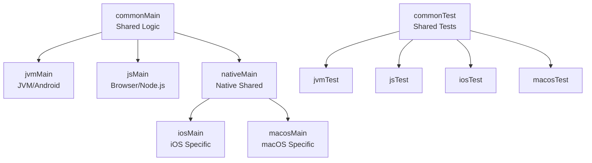
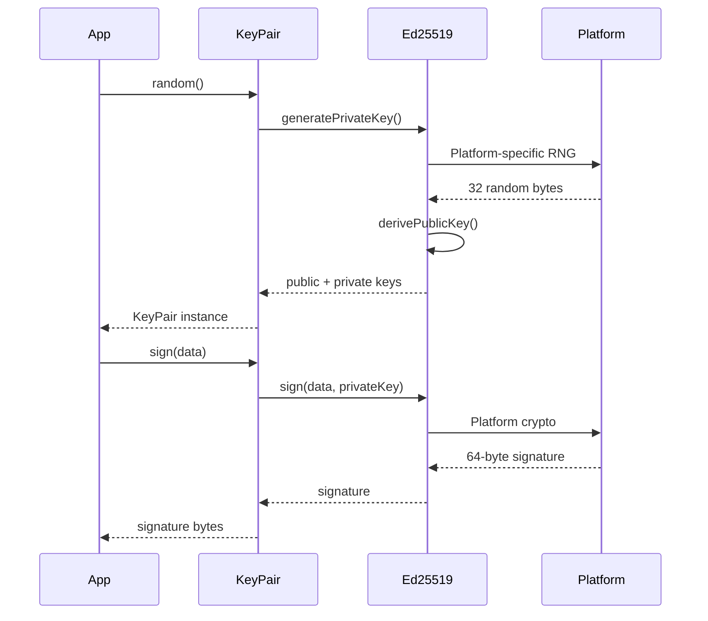
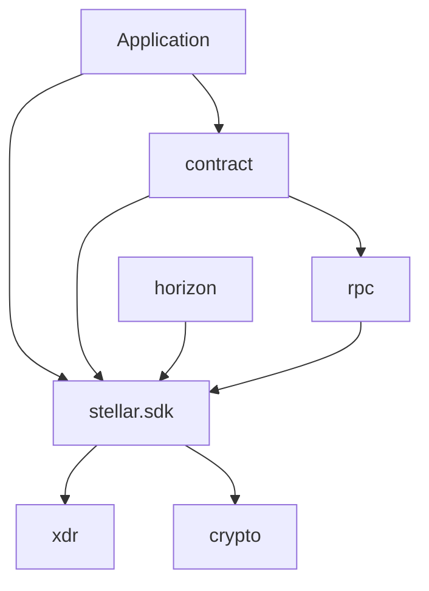
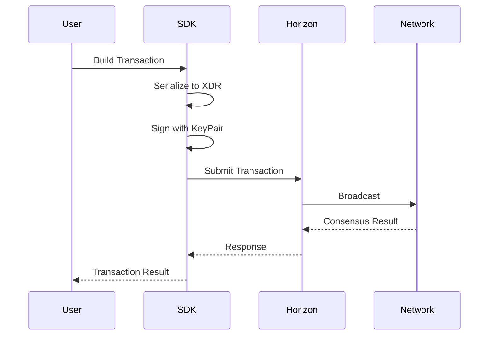
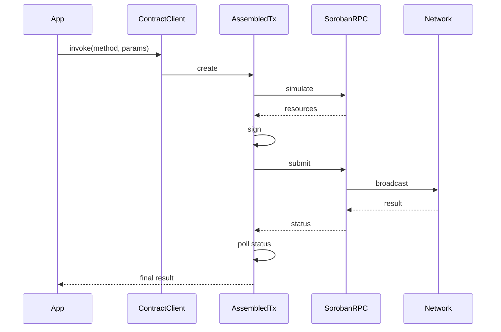
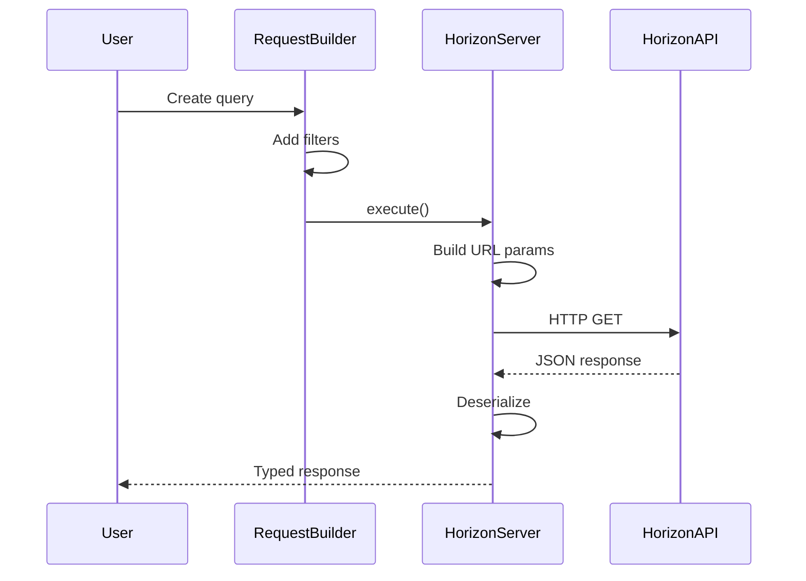
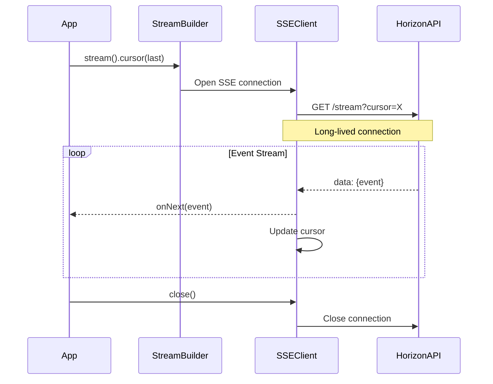

# Architecture Guide

This document provides a comprehensive overview of the Stellar KMP SDK's architecture, design decisions, and implementation details.

## Table of Contents

- [Project Structure](#project-structure)
- [Multiplatform Architecture](#multiplatform-architecture)
- [Cryptographic Implementation](#cryptographic-implementation)
- [Async API Design](#async-api-design)
- [Module Organization](#module-organization)
- [Data Flow Architecture](#data-flow-architecture)
  - [Data Querying Architecture](#data-querying-architecture)
- [Design Patterns](#design-patterns)
- [Security Architecture](#security-architecture)

## Project Structure

```
kmp-stellar-sdk/
├── stellar-sdk/                    # Main SDK library
│   ├── src/
│   │   ├── commonMain/            # Shared Kotlin code (95% of SDK)
│   │   │   ├── contract/          # Smart contract client
│   │   │   ├── crypto/            # Crypto abstractions
│   │   │   ├── horizon/           # Horizon API client
│   │   │   ├── rpc/               # Soroban RPC client
│   │   │   ├── scval/             # Smart contract values
│   │   │   └── xdr/               # XDR serialization
│   │   ├── commonTest/            # Shared tests
│   │   ├── jvmMain/               # JVM-specific (BouncyCastle)
│   │   ├── jsMain/                # JS-specific (libsodium.js)
│   │   ├── nativeMain/            # Native shared (libsodium)
│   │   ├── iosMain/               # iOS-specific
│   │   └── macosMain/             # macOS-specific
│   └── build.gradle.kts
└── demo/                          # Demo applications
    ├── shared/                    # Compose Multiplatform UI
    ├── androidApp/                # Android entry point
    ├── iosApp/                   # iOS wrapper
    ├── macosApp/                 # macOS native UI
    ├── desktopApp/               # Desktop JVM
    └── webApp/                   # Web with Vite
```

## Multiplatform Architecture

### Core Principles

1. **Maximum Code Sharing**: ~95% of code is in `commonMain`, shared across all platforms
2. **Platform-Specific Optimizations**: Critical components (crypto, networking) use platform-native implementations
3. **Consistent API Surface**: Same API across all platforms, with platform-specific implementations hidden
4. **Type Safety**: Leverage Kotlin's type system for compile-time safety

### Source Set Hierarchy

**Source Set Organization** (if diagram doesn't render, see text below):
- `commonMain` (shared logic) branches to: `jvmMain` (JVM/Android), `jsMain` (Browser/Node.js), and `nativeMain` (native shared)
- `nativeMain` further branches to: `iosMain` (iOS specific) and `macosMain` (macOS specific)
- Test hierarchy mirrors main hierarchy: `commonTest` → `jvmTest`, `jsTest`, `iosTest`, `macosTest`



### Expect/Actual Pattern

The SDK uses Kotlin's expect/actual mechanism for platform-specific implementations:

```kotlin
// commonMain - Declaration
expect object Ed25519 {
    suspend fun generatePrivateKey(): ByteArray
    suspend fun derivePublicKey(privateKey: ByteArray): ByteArray
    suspend fun sign(message: ByteArray, privateKey: ByteArray): ByteArray
    suspend fun verify(message: ByteArray, signature: ByteArray, publicKey: ByteArray): Boolean
}

// jvmMain - Implementation
actual object Ed25519 {
    actual suspend fun generatePrivateKey(): ByteArray {
        // BouncyCastle implementation
    }
    // ...
}

// jsMain - Implementation
actual object Ed25519 {
    actual suspend fun generatePrivateKey(): ByteArray {
        // libsodium.js implementation
    }
    // ...
}
```

## Cryptographic Implementation

### Platform-Specific Libraries

| Platform | Library | Algorithm | Security Features |
|----------|---------|-----------|-------------------|
| JVM | BouncyCastle 1.78 | Ed25519 (RFC 8032) | FIPS 140-2 Level 1, Constant-time |
| JavaScript | libsodium-wrappers-sumo 0.7.13 | Ed25519, SHA-256 | Audited, WebAssembly sandboxed, Sumo for SHA-256 |
| iOS/macOS | libsodium (native) | Ed25519 (crypto_sign) | Audited, Constant-time, Memory-safe |

### Cryptographic Operations Flow

**KeyPair Generation and Signing Flow** (if diagram doesn't render, see text below):
1. **Generation**: App calls `KeyPair.random()` → KeyPair calls `Ed25519.generatePrivateKey()` → Ed25519 uses platform-specific RNG to get 32 random bytes → Ed25519 derives public key → Returns KeyPair instance to App
2. **Signing**: App calls `KeyPair.sign(data)` → KeyPair calls `Ed25519.sign(data, privateKey)` → Ed25519 uses platform crypto library → Returns 64-byte signature to App



## Async API Design

### Why Suspend Functions?

The SDK uses Kotlin's `suspend` functions for all cryptographic operations:

```kotlin
class KeyPair {
    suspend fun sign(data: ByteArray): ByteArray
    suspend fun verify(data: ByteArray, signature: ByteArray): Boolean

    companion object {
        suspend fun random(): KeyPair
        suspend fun fromSecretSeed(seed: String): KeyPair
    }
}
```

**Rationale:**

1. **JavaScript Requirement**: libsodium.js requires async initialization
2. **Consistency**: Same API pattern across all platforms
3. **Zero Overhead**: On JVM/Native, suspend functions that don't actually suspend compile to regular functions
4. **Future-Proof**: Allows for async hardware wallet integration

### Coroutine Context Usage

```kotlin
// Android
lifecycleScope.launch {
    val keypair = KeyPair.random()
    updateUI(keypair)
}

// iOS (from Swift)
Task {
    let keypair = try await KeyPair.companion.random()
    DispatchQueue.main.async {
        self.updateUI(keypair)
    }
}

// JavaScript
MainScope().launch {
    val keypair = KeyPair.random()
    updateDOM(keypair)
}

// Server/JVM
runBlocking {
    val keypair = KeyPair.random()
    processKeypair(keypair)
}
```

## Module Organization

### Core Modules

#### `com.soneso.stellar.sdk`
Core SDK functionality:
- `KeyPair` - Key management
- `Transaction` - Transaction building
- `Operation` - All Stellar operations
- `Asset` - Asset representation
- `Network` - Network configuration

#### `com.soneso.stellar.sdk.horizon`
Horizon API client:
- `HorizonServer` - Main client
- `responses/` - Response models
- `requests/` - Request builders

#### `com.soneso.stellar.sdk.rpc`
Soroban RPC client:
- `SorobanServer` - RPC client
- Contract data queries
- Transaction simulation

#### `com.soneso.stellar.sdk.contract`
Smart contract interaction:
- `ContractClient` - High-level client with dual API patterns
  - Simple Map-based invoke for beginners (auto-converts native types)
  - Advanced buildInvoke for manual transaction control (Map-based arguments, essential for multi-signature workflows)
  - One-step and two-step deployment capabilities
- `AssembledTransaction` - Transaction lifecycle management
- `ClientOptions` - Configuration for contract operations
- `ContractSpec` - Type conversion between native and XDR
- `exception/` - Contract-specific exceptions (10 types)

#### `com.soneso.stellar.sdk.xdr`
XDR serialization:
- 424 XDR type definitions
- Encoding/decoding logic
- Binary serialization

### Dependency Graph

**Module Dependencies** (if diagram doesn't render, see text below):
- Application depends on: Contract, SDK
- Contract depends on: SDK, RPC
- SDK depends on: XDR, Crypto
- Horizon and RPC both depend on: SDK



## Data Flow Architecture

### Transaction Flow

**Transaction Submission Flow** (if diagram doesn't render, see text below):
1. User → SDK: Build Transaction
2. SDK: Serialize to XDR, Sign transaction
3. SDK → Horizon: Submit XDR
4. Horizon → Network: Broadcast transaction
5. Network → Horizon: Transaction result
6. Horizon → SDK: Response
7. SDK → User: Transaction result



### Smart Contract Interaction Flow

**Contract Invocation Flow** (if diagram doesn't render, see text below):
1. App → ContractClient: invoke(method, params)
2. ContractClient creates AssembledTransaction
3. AssembledTransaction → SorobanRPC: simulate (to estimate resources)
4. SorobanRPC → AssembledTransaction: returns resources
5. AssembledTransaction: signs transaction
6. AssembledTransaction → SorobanRPC: submit transaction
7. SorobanRPC → Network: broadcast
8. Network → SorobanRPC: result
9. AssembledTransaction: polls for status
10. AssembledTransaction → App: final result



### Data Querying Architecture

The SDK provides sophisticated data querying capabilities through two primary mechanisms: the Request Builder pattern for Horizon API queries and Server-Sent Events (SSE) for real-time streaming.

#### Request Builder Pattern

The SDK employs a fluent builder pattern for constructing type-safe queries against the Horizon API. This architectural choice provides:

- **Type Safety**: Each endpoint has its own builder with appropriate filter methods
- **Composability**: Filters can be chained to create complex queries
- **Pagination Control**: Built-in cursor-based pagination support
- **Query Optimization**: Automatic parameter validation before requests

Architectural flow:
```kotlin
// Builder constructs query parameters progressively
server.accounts()
    .forSigner(signerKey)      // Add signer filter
    .cursor("token")           // Set pagination cursor
    .limit(20)                 // Set page size
    .order(Order.DESC)         // Set result ordering
    .execute()                 // Transform to HTTP request
```

#### Data Query Flow



#### SSE Streaming Architecture

For real-time updates, the SDK implements Server-Sent Events streaming, which differs fundamentally from request-response queries:

**Architectural Characteristics**:
- **Long-Lived Connections**: Single HTTP connection maintained for event stream
- **Push-Based Updates**: Server pushes events as they occur on the network
- **Cursor Persistence**: Each event includes a cursor for resumption after disconnection
- **Resource Efficiency**: No polling overhead, events delivered immediately



#### Soroban RPC Query Architecture

Soroban RPC queries follow a different pattern optimized for smart contract data:

- **Event Filtering**: Complex filters for contract events (topic, contract ID, time range)
- **Direct Ledger Access**: Query specific ledger entries by key
- **Batch Operations**: Multiple queries in single RPC call for efficiency
- **State Proofs**: Optional inclusion of Merkle proofs for verification

The architecture separates concerns between Horizon (account/transaction data) and Soroban RPC (contract state/events), allowing optimal query patterns for each data type.

## Design Patterns

### Builder Pattern

Used extensively for transaction construction:

```kotlin
val transaction = TransactionBuilder(account, network)
    .addOperation(PaymentOperation(...))
    .addOperation(CreateAccountOperation(...))
    .addMemo(Memo.text("Payment"))
    .setBaseFee(100)
    .setTimeout(300)
    .build()
```

### Factory Pattern

KeyPair creation uses static factory methods:

```kotlin
companion object {
    suspend fun random(): KeyPair
    suspend fun fromSecretSeed(seed: String): KeyPair
    fun fromAccountId(accountId: String): KeyPair
    fun fromPublicKey(publicKey: ByteArray): KeyPair
}
```

### Immutable Objects

All public API objects are immutable:

```kotlin
class KeyPair private constructor(
    private val publicKey: ByteArray,
    private val privateKey: ByteArray?
) {
    // No setters, all properties are private/readonly
    fun getPublicKey(): ByteArray = publicKey.copyOf()
}
```

## Security Architecture

The SDK implements multiple layers of security to protect sensitive operations and data.

### Security Principles

1. **No Custom Cryptography**: Only audited, production-ready libraries (BouncyCastle, libsodium)
2. **Defense in Depth**: Multiple security layers from input validation to memory management
3. **Secure by Default**: Safe defaults, explicit opt-in for potentially dangerous operations
4. **Memory Safety**: Minimize exposure of sensitive data in memory

### Key Management Security

- **Private keys** are stored as `ByteArray?` and never logged or serialized unintentionally
- **CharArray** used for secret seeds (can be zeroed after use)
- **Defensive copies** returned for all key material
- **Immutable KeyPair** prevents accidental modification

### Cryptographic Security

All platforms use battle-tested libraries with:
- **Constant-time operations** to prevent timing attacks
- **Secure random number generation** from system CSPRNG
- **Validated parameters** before any crypto operation
- **No experimental algorithms** - only Ed25519 as specified by Stellar

### Network Security

- **HTTPS only** for all Horizon and Soroban RPC connections
- **Certificate validation** by platform networking libraries
- **Request signing** for sensitive operations
- **Automatic retries** with exponential backoff to handle transient failures

## Architecture Decision Records (ADRs)

### ADR-001: Async Crypto API

**Status**: Accepted

**Context**: JavaScript's libsodium requires async initialization

**Decision**: Use suspend functions for all crypto operations

**Consequences**:
- ✅ Consistent API across platforms
- ✅ Zero overhead on JVM/Native
- ✅ Future-proof for async hardware wallets
- ⚠️ Requires coroutine context

### ADR-002: Production Crypto Only

**Status**: Accepted

**Context**: Security is paramount for a financial SDK

**Decision**: Only use audited, production crypto libraries

**Consequences**:
- ✅ High security confidence
- ✅ Avoid custom crypto pitfalls
- ✅ Community trust
- ⚠️ Platform-specific dependencies

### ADR-003: Immutable Public API

**Status**: Accepted

**Context**: Thread safety and predictability

**Decision**: All public API objects are immutable

**Consequences**:
- ✅ Thread-safe by default
- ✅ Predictable behavior
- ✅ Easier to reason about
- ⚠️ More object creation

---

**Navigation**: [← Demo App](demo-app.md) | [SDK Usage Examples →](sdk-usage-examples.md)